# nanowall

**Turn your family photos into a living, 50-wallpaper Windows desktop carousel, and keep the faces recognisable.**

Drop in your favourite photos. nanowall indexes the people and pets in them, builds an identity pack per person,
generates wallpapers with Google's Nano Banana Pro (`gemini-3-pro-image-preview`), has every image judged against
the real faces, and rotates the winners on your desktop on a timer.

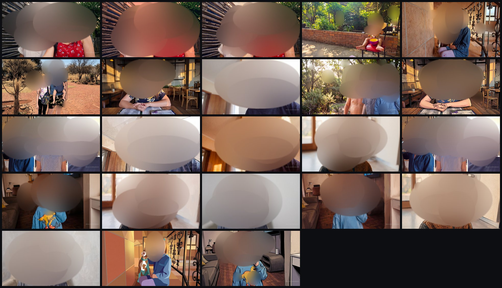

> Every face in this README has been blurred for privacy. In the app, the faces are the point.

---

## Contents

- [Why nanowall](#why-nanowall)
- [Quick start (Windows exe)](#quick-start-windows-exe)
- [Using the app](#using-the-app)
- [How it works](#how-it-works)
- [Examples](#examples)
- [Run from source](#run-from-source)
- [Build the exe](#build-the-exe)
- [Privacy and data](#privacy-and-data)
- [Costs](#costs)
- [Troubleshooting](#troubleshooting)
- [Project layout](#project-layout)

---

## Why nanowall

Most "AI wallpaper from your photos" tools write a long description of each person and ask the model to paint it
in five styles at once. The result is an average of every person who matches the description, not *your* kid.

nanowall is built around one rule: **lock the person first, then paint the lock.**

| Common failure | What nanowall does instead |
| --- | --- |
| Text description of a face ("girl with light brown hair") | Real face crops are attached as the identity reference; prompts name people only as "person 1", "person 2" |
| Background, pose, medium and light all change in one render | **One change per render**: LOCK changes one thing, STYLE starts from an approved LOCK |
| Watercolor / vector / woodblock slots dominate the carousel | **Quota by recognisability**: 20 LOCK, 15 light paint, 10 faced styles, 5 wildcards |
| Whole album pasted in as references, faces average out | 4 to 5 references max: source moment plus one face sheet per person |
| Strangers in the background treated as family | Main subjects only; every crop is verified to actually be a face |

---

## Quick start (Windows exe)

1. Download `nanowall.exe` from the [latest release](../../releases/latest) and put it in its own folder,
   e.g. `C:\nanowall\`.
2. Double-click `nanowall.exe`. A console window opens and the app opens in your browser at `http://127.0.0.1:8765`.
   - Windows SmartScreen may warn because the exe is unsigned: **More info > Run anyway**.
3. Paste a **Gemini API key** (get one at [aistudio.google.com/apikey](https://aistudio.google.com/apikey)) and click
   **Save key**. Image generation with Nano Banana Pro needs a billing-enabled key.
4. Drag **3 to 20 photos** onto the drop zone. Building starts automatically.
5. Leave the console window open. New wallpapers land on your desktop as they pass review, and the desktop rotates
   through the carousel on the interval you choose.

No Python, no installer. Everything the app saves stays in a `nanowall-data` folder beside the exe, so the folder is
fully portable: copy it to a USB stick or another PC and your key, photos and progress come with it.

---

## Using the app

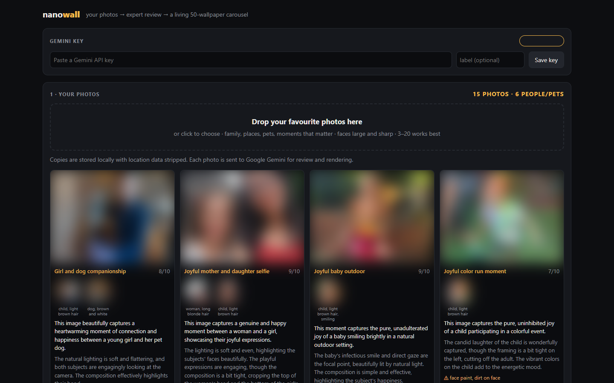

**1. Gemini key.** Save one or more keys and click a chip to switch between them (right-click to remove). Keys are
stored locally in `nanowall-data/keys.json`, masked in the UI, and only ever sent to Google's API.

**2. Your photos.** Each photo card shows what the expert pass found: the theme, a photographer's critique, a round
crop of every detected person and pet, and warnings that predict face drift (harsh flash, face paint, toy glasses,
small faces). Weak faces get a red ring.

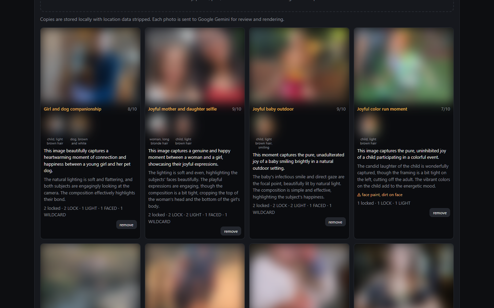

**3. Carousel.** A progress bar toward 50, pause/resume, previous/next wallpaper, and the rotation interval
(5 minutes to daily). Click any thumbnail to put it on the desktop now; hover and click the cross to delete one and a
replacement is generated. Each thumbnail shows its mode and its likeness score.

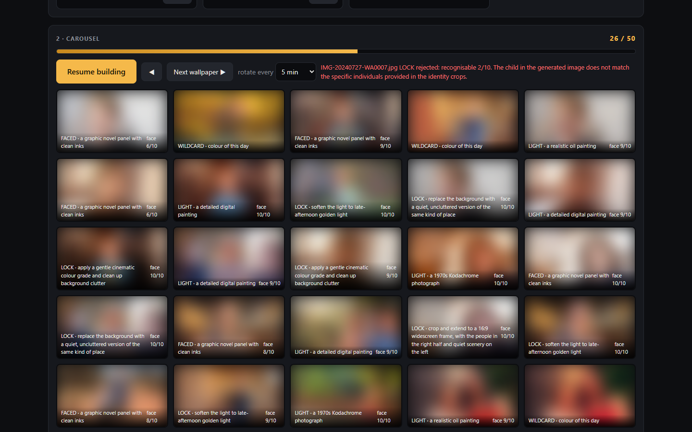

Every delivered wallpaper carries a small watermark in the bottom-right corner, placed just above the taskbar.

---

## How it works

```
photo ─▶ people index ─▶ identity pack ─▶ LOCK render ─▶ judge ─▶ carousel
                                              │
                                              └─▶ STYLE render (from LOCK) ─▶ judge ─▶ carousel
```

### Stage A: people index (`identity.py`)

1. **Detect** – one Gemini Flash pass per photo finds the *main* subjects (people, dogs, cats) and ignores background
   strangers, and writes a short theme and critique.
2. **Snap** – each face box is re-centred on the real face with OpenCV, and two subjects can never claim the same
   face.
3. **Verify** – a second pass looks at every crop and drops anything that is not clearly a face (foliage, blur,
   darkness) and assigns a neutral label.
4. **Group** – crops across the whole album are grouped into identities; two faces from the same photo are never the
   same person. The best 1 to 3 crops per identity become that person's face sheet.

### Stage B: two render modes (`modes.py`)

- **LOCK** (prove it is them): photoreal, same pose and clothes, and exactly *one* change – a 16:9 crop, a quieter
  background, softer light, or a gentle grade. Printed words on clothing are removed.
- **STYLE** (paint the lock): starts from an approved LOCK image and restyles the whole frame. Faces and spatial
  relationships stay; clothing keeps its colours.

A photo that fails LOCK repeatedly never gets styled versions; its card suggests a clearer source photo instead.

### Stage C: the judge

Every render is scored by Gemini Flash against the real face crops:

| Check | Pass bar |
| --- | --- |
| Recognisable: would a grandparent know them at a 5-second glance? | LOCK 8, light paint 7, faced 6, wildcard n/a |
| Frame: fills 16:9 edge to edge, no bars or panels | 7 (plus a local flat-edge detector) |
| Clean: no readable text or logos anywhere, including clothing | 9 |
| Quality: no extra limbs, melted hands, new people | 7 |
| Style: the whole image is actually in the requested medium | 7 |

Failures are retried once with the judge's one-sentence fix. If Gemini's safety filter blocks an image
(`IMAGE_SAFETY`), that slot is skipped and building continues; a photo blocked three times is set aside.

### Stage D: carousel quota

| Mode | Slots | Styles |
| --- | --- | --- |
| LOCK | 20 | photoreal, one change |
| LIGHT | 15 | realistic oil painting, detailed digital painting, 1970s Kodachrome |
| FACED | 10 | watercolor, graphic novel panel |
| WILDCARD | 5 | vector colour field, pixel art, abstract geometric – captioned "colour of this day", no face promise |

The worker always fills the mode with the biggest shortfall against that mix, and cycles through photos least-used
first.

---

## Examples

All generated by nanowall from a real family album. Faces blurred for this README.

| LOCK – photoreal, one change | LIGHT – Kodachrome / oil / digital painting |
| --- | --- |
| 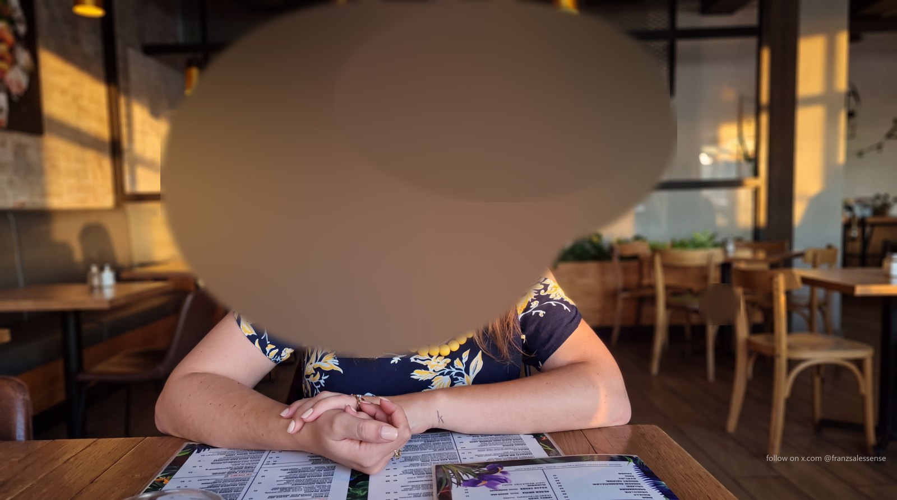 | 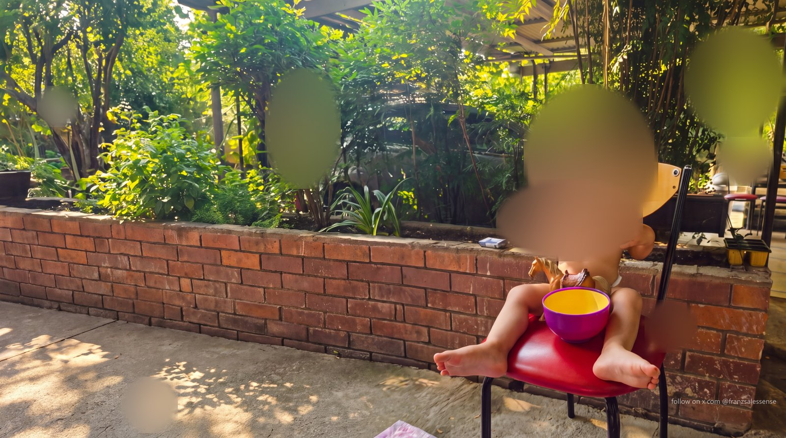 |
| 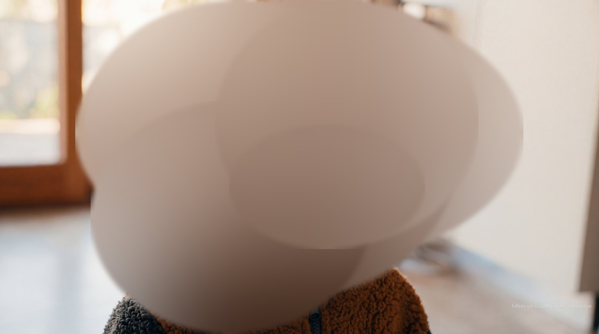 | 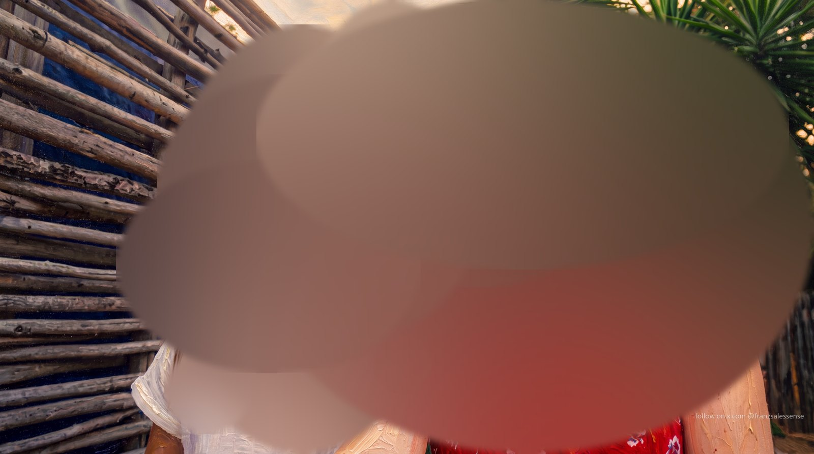 |

| FACED – graphic novel / watercolor | WILDCARD – colour of this day |
| --- | --- |
| 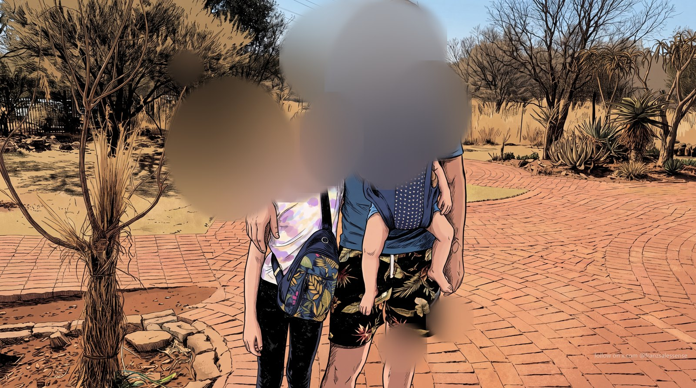 | 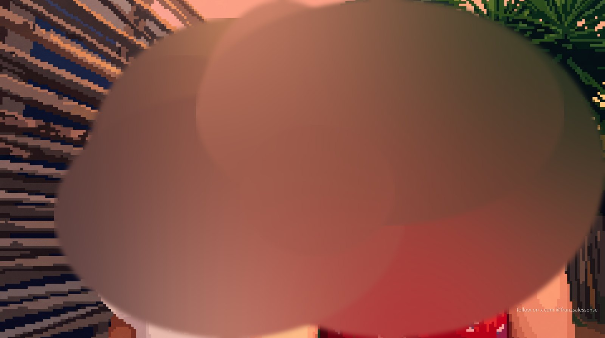 |
| 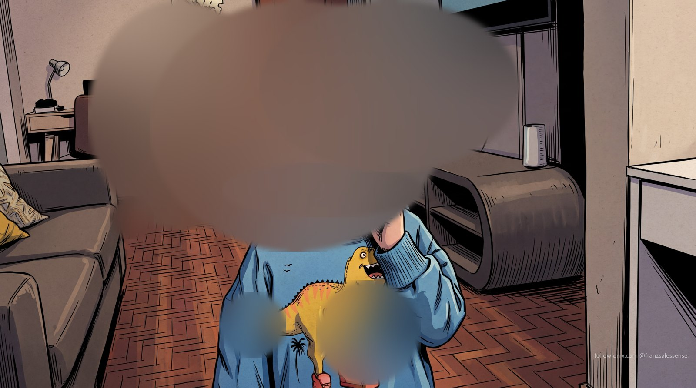 | 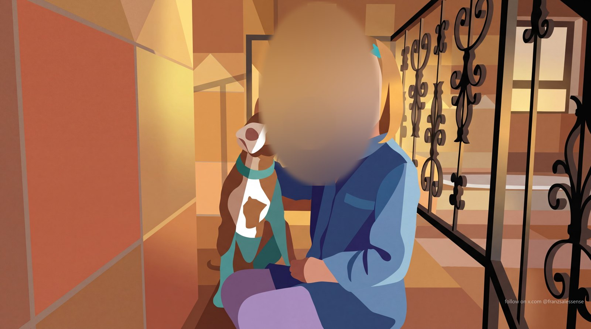 |

The full set is in [`docs/examples/`](docs/examples), with each image's mode, style and likeness score in
[`manifest.json`](docs/examples/manifest.json).

---

## Run from source

Requires Windows (wallpaper setting uses the Win32 API) and Python 3.11+.

```bash
git clone https://github.com/bully911210/nanowall.git
cd nanowall
pip install -r requirements.txt
python app.py
```

`python app.py --no-browser` starts the server without opening a tab. When run from source, data is written next to
the source files; `.gitignore` keeps keys, photos and generated images out of git.

---

## Build the exe

```bash
build.bat
```

`build.bat` runs PyInstaller with `nanowall.spec` (bundling `index.html` and OpenCV's face cascade), copies the result
to `%USERPROFILE%\Desktop\nanowall-app\nanowall.exe`, and cleans up. Close any running `nanowall.exe` first.

---

## Privacy and data

- Photos are copied into `nanowall-data/library/` and **re-encoded, which strips EXIF and GPS location data**.
- Photos, face crops and renders are sent to **Google's Gemini API** for analysis, judging and generation. Nothing
  else leaves your machine; the server listens on `127.0.0.1` only and rejects cross-site requests.
- Keys live in `nanowall-data/keys.json` in plain text on your disk. Treat the folder like a password file.
- Delete the `nanowall-data` folder to remove everything.

---

## Costs

Each carousel slot uses one to two Nano Banana Pro 4K generations plus a few cheap Gemini Flash calls for detection
and judging. A full 50-wallpaper carousel is typically **60 to 120 image generations**. Check current pricing on
Google's Gemini API pricing page before you start; set a budget alert on the key.

---

## Troubleshooting

| Symptom | Fix |
| --- | --- |
| "Add your Gemini key first" | Paste a key in the Gemini key panel and click **Save key**. |
| `API key not valid` / `PERMISSION_DENIED` / billing errors | Building stops. Use a billing-enabled key with access to `gemini-3-pro-image-preview`. |
| Status says "Skipped … filtered by Gemini" | Google's safety filter blocked that render (common with young children). It is skipped automatically. |
| A photo card warns "Couldn't lock these faces" | The faces are too small, blurred or covered. Add a sharper photo with larger faces. |
| Wallpaper stopped changing | The console window was closed. Start `nanowall.exe` again; it resumes where it stopped. |
| Page does not load | Something else is using port 8765 (for example a second copy of nanowall). Close it and retry. |
| SmartScreen blocks the exe | **More info > Run anyway** (the exe is not code-signed). |

---

## Project layout

```
app.py          local web server + API (127.0.0.1:8765)
engine.py       background worker, carousel state, watermark, rotation
identity.py     Stage A: detection, face snapping, crop verification, identity grouping
modes.py        Stages B-D: LOCK / STYLE prompts, judge, quota
auto.py         Gemini API client and the flat-edge (letterbox) detector
photos.py       image loading helpers
nanowall.py     paths, wallpaper setting via Win32, shared errors
index.html      the whole UI (no build step)
nanowall.spec   PyInstaller spec
build.bat       one-click exe build
```

---

Built with Claude Code. Follow on X: [@franzsalessense](https://x.com/franzsalessense)
